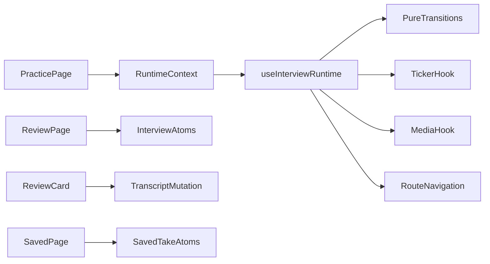

# Interview Runtime Cleanup Plan

## Goal

Keep the cleaner `useInterviewRuntime()` orchestration approach, but harden the current implementation so it is type-safe, testable, locale-aware, and complete. The main change is not to move orchestration back into route components, but to make the runtime facade compose smaller internals.

## Stage 1: Fix Compile-Level Breakages

**Files touched:**

- `[src/app/[locale]/review/review-question-card.tsx](src/app/[locale]/review/review-question-card.tsx)`
- `[src/logic/atoms.ts](src/logic/atoms.ts)`
- `[src/app/[locale]/saved/saved-takes-panel.tsx](src/app/[locale]/saved/saved-takes-panel.tsx)`

**Changes:**

- Fix `Controls` so its props match usage. Current code renders `<Controls response={response} />` while `ResponseControlsProps` requires `onResponse` and `Controls` calls `onResponse(...)`.
- Decide whether transcript results live in `responsesAtom` or a separate transcript atom. Prefer updating `responsesAtom` for per-response transcripts to avoid two competing sources of truth.
- Add or remove the missing saved-take atoms used by `SavedTakesPanel`: `savedTakesAtom`, `transcriptsAtom`, `generateTranscriptActionAtom`, `removeBookmarkActionAtom`. If saved takes are not ready, hide or isolate that route instead of importing atoms that do not exist.

**Behavior preserved or intentionally changed:**

- Preserve `/practice`, `/review`, and `/saved` route shape.
- Preserve transcript button UX, but make transcript result persistence explicit.
- Intentionally change incomplete saved-take wiring into either working atoms or a deliberately unavailable/empty saved state.

**Test/build command:**

- `npm run lint`
- `npx tsc --noEmit`
- `npm run build`

**Risks:**

- Updating `responsesAtom` from nested review controls can cause broad re-renders if done naively.
- Saved takes may need a separate product decision if durable storage is still desired.

## Stage 2: Extract Pure Interview Transitions

**Files touched:**

- `[src/logic/interview.ts](src/logic/interview.ts)`
- New `[src/logic/interview-state.ts](src/logic/interview-state.ts)` or `[src/logic/interview-transitions.ts](src/logic/interview-transitions.ts)`
- New tests beside the transition module
- `[src/logic/types.ts](src/logic/types.ts)` if transition event types are added

**Changes:**

- Move `computeNextState` out of `useInterviewStateUpdater()` into a pure exported function.
- Add transition helpers for start, tick, finish response, early end, and retake if they clarify intent.
- Cover countdown-to-question, question-to-next-countdown, final-question-complete, retake-complete, and early-end transitions with unit tests.

**Behavior preserved or intentionally changed:**

- Preserve current phase vocabulary: `preparing`, `countdown`, `question`, `complete`.
- Preserve count-up timer model: `countdownTime` and `questionTime` increment toward configured durations.
- Intentionally change only implementation shape: runtime hook calls pure functions instead of embedding transition rules inside React hooks.

**Test/build command:**

- New transition test command if a test script exists, otherwise add one deliberately.
- `npm run lint`
- `npx tsc --noEmit`
- `npm run build`

**Risks:**

- Current runtime also increments timers in `useInterviewTicker`; make sure transition tests model the same order of operations as runtime ticks.

## Stage 3: Keep `useInterviewRuntime()` But Split Its Internals

**Files touched:**

- `[src/logic/interview.ts](src/logic/interview.ts)`
- `[src/logic/media.ts](src/logic/media.ts)`
- `[src/logic/context.tsx](src/logic/context.tsx)`
- Optional new modules such as `[src/logic/interview-ticker.ts](src/logic/interview-ticker.ts)`, `[src/logic/interview-media-controller.ts](src/logic/interview-media-controller.ts)`, `[src/logic/interview-navigation.ts](src/logic/interview-navigation.ts)`

**Changes:**

- Keep `useInterviewRuntime()` as the public facade with a small API: `startInterview`, `togglePauseInterview`, `isPaused`, `endResponse`, `endInterviewEarly`.
- Move ticker details out of `src/logic/interview.ts` into a focused hook.
- Move recorder phase-to-command wiring out of the main runtime body into a focused hook.
- Move completion navigation into a small helper/hook so the runtime does not inline the full completion effect.
- Keep contexts thin: `InterviewContext` can keep `userMediaPreviewRef`; `InterviewRuntimeContext` can expose the runtime facade, but should not grow into a large state bag.

**Behavior preserved or intentionally changed:**

- Preserve the cleaner route API: practice page asks runtime to start/pause/finish; it does not coordinate timer/media itself.
- Preserve current Jotai-backed state approach for this cleanup pass.
- Intentionally reduce file-level coupling without changing user flow.

**Test/build command:**

- `npm run lint`
- `npx tsc --noEmit`
- `npm run build`

**Risks:**

- Splitting hooks can create stale closure bugs around `interview`, `mediaRecorder`, and timer callbacks. Keep hook inputs explicit and covered by transition tests where possible.

## Stage 4: Fix Recorder Attribution And Media Cleanup

**Files touched:**

- `[src/logic/interview.ts](src/logic/interview.ts)`
- `[src/logic/media.ts](src/logic/media.ts)`
- `[src/logic/types.ts](src/logic/types.ts)`

**Changes:**

- Stop inferring response question ID with `interview.currentQuestionIndex - 1`. Current code can misattribute recordings, especially on early end.
- Store explicit recording context when a question starts recording, for example `{ questionId, questionIndex }`, and use that in the `dataavailable` handler.
- Add media stream cleanup: stop all tracks when the interview completes, restarts, fails to initialize, or component unmounts.
- Avoid `alert("Preview video element not found")`; surface an error through runtime/start mutation instead.

**Behavior preserved or intentionally changed:**

- Preserve one recorded response per question attempt.
- Intentionally fix early-end attribution and possible camera/microphone leaks.

**Test/build command:**

- `npm run lint`
- `npx tsc --noEmit`
- `npm run build`
- Manual smoke: start, finish first response, finish all responses, end early during first response, retake.

**Risks:**

- MediaRecorder `dataavailable` timing is browser-sensitive. Keep the context stable in a ref rather than deriving from mutable interview state.

## Stage 5: Make Routing Locale-Aware

**Files touched:**

- `[src/logic/interview.ts](src/logic/interview.ts)`
- `[src/app/[locale]/review/page.tsx](src/app/[locale]/review/page.tsx)`
- Any route links in `[src/app/[locale]/(root)/app-shell.tsx](src/app/[locale]/(root)`/app-shell.tsx)

**Changes:**

- Replace hardcoded `router.push("/review")` and `router.push("/practice")` with locale-aware routing.
- Prefer a shared route helper if the project already has one; otherwise use `useLocale()` where routing is initiated.
- Ensure `useAddTake()` routes back to the localized practice route.

**Behavior preserved or intentionally changed:**

- Preserve route destinations semantically.
- Intentionally keep users in the current locale after start/review/retake navigation.

**Test/build command:**

- `npm run lint`
- `npx tsc --noEmit`
- `npm run build`
- Manual smoke: `/en/practice -> /en/review`, `/es/practice -> /es/review`, retake from both locales.

**Risks:**

- Runtime hooks currently call `useRouter`; adding `useLocale` there increases coupling slightly. A small navigation hook can contain that coupling cleanly.

## Stage 6: Fix Review Media And Transcript UX

**Files touched:**

- `[src/app/[locale]/review/review-question-card.tsx](src/app/[locale]/review/review-question-card.tsx)`
- Optional reusable component for recording playback

**Changes:**

- Replace `URL.createObjectURL(response.recording)` inside render with a memoized object URL and cleanup, or create playback URLs when responses are stored.
- Render transcript text after generation, not only mutate state silently.
- Remove stale commented-out blocks once the live behavior is implemented.
- Consider extracting `TranscriptButton`, `RecordingVideo`, and `BookmarkIcon` only if reuse is immediate.

**Behavior preserved or intentionally changed:**

- Preserve horizontal review-card layout.
- Intentionally fix object URL leaks and make transcript generation visibly useful.

**Test/build command:**

- `npm run lint`
- `npx tsc --noEmit`
- `npm run build`
- Manual smoke: generate transcript on a response and confirm text appears; navigate away and back without broken video URLs.

**Risks:**

- If responses store raw `Blob`s only, review state still disappears on refresh. That is acceptable unless durable sessions become a requirement.

## Stage 7: Decide And Complete Saved Takes

**Files touched:**

- `[src/logic/atoms.ts](src/logic/atoms.ts)`
- `[src/app/[locale]/saved/saved-takes-panel.tsx](src/app/[locale]/saved/saved-takes-panel.tsx)`
- Optional storage module if persistence is needed

**Changes:**

- Choose one implementation path:
  - Lightweight Jotai path: define saved-take atoms and keep saved takes in-memory or `atomWithStorage` if data is serializable.
  - Durable media path: use IndexedDB for blobs and expose Jotai/query state over that repository.
- Wire bookmark add/remove from review cards if saved takes remain in scope.
- Remove dead imports/comments if saved takes are deferred.

**Behavior preserved or intentionally changed:**

- Preserve `/saved` only if it has working state.
- Intentionally avoid half-wired saved-take UI.

**Test/build command:**

- `npm run lint`
- `npx tsc --noEmit`
- `npm run build`
- Manual smoke: save, view saved, remove saved, reload if persistence is implemented.

**Risks:**

- `atomWithStorage` is not a good fit for raw `Blob` persistence. If saved media must survive reloads, use IndexedDB.

## Non-Goals

- Do not move orchestration back into `PracticeSurface`.
- Do not replace the `useInterviewRuntime()` facade with a broad provider state bag.
- Do not redesign the UI beyond necessary correctness fixes.
- Do not add auth, server persistence, or full interview history unless separately scoped.

