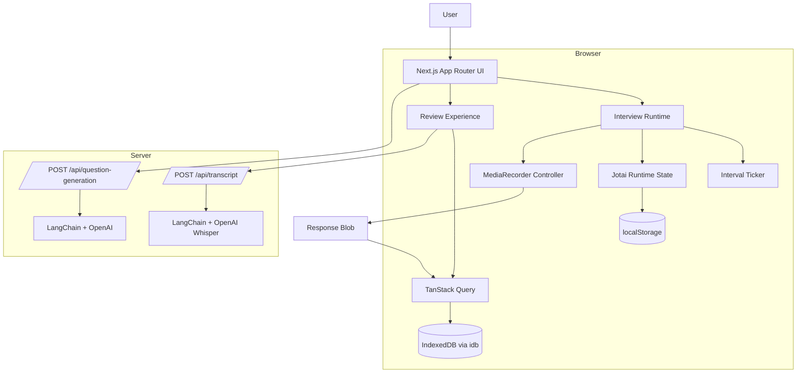

# Pulse

Pulse is a interview practice app for recording and reviewing behavioural interview responses. The app keeps the main recording flow entirely client-side, while optional AI workflows like transcription and question generation run through server APIs.

## Overview

The goal of the project was to make interview practice feel fast and local-first without relying on continuous video uploads or server-managed recording sessions.

Recordings are captured directly in the browser with `MediaRecorder`, stored locally in IndexedDB, and loaded back into the review UI through TanStack Query. AI features are opt-in rather than part of the core recording flow.

The project started as an AI-generated prototype with tightly coupled recording logic and monolithic component state, then gradually evolved into a more structured runtime for managing timing, recording, persistence, and review flows.

## Architecture



## Runtime

The interview flow is coordinated through a small runtime layer `/src/logic/interview.ts`.

Components interact with the runtime API for actions like:

* starting and ending responses;
* pausing interview sessions;
* retaking answers;
* progressing between interview phases.

Internally, the runtime manages:

* countdown and recording state;
* timer progression through a shared ticker;
* camera and microphone setup with `getUserMedia`;
* recording lifecycle events from `MediaRecorder`;
* persistence when recordings are finalized.

Refactoring the AI-generated prototype moved the project away from 20+ scattered `useState` hooks and large prop chains into more isolated timing, media, and persistence layers.

## Persistence

Interview sessions contain both lightweight application state and large blob recordings, so the app uses separate storage layers for each.

| Data                                       | Storage                |
| ------------------------------------------ | ---------------------- |
| Interview config, metadata, question lists | Jotai + `localStorage` |
| Recorded video blobs                       | IndexedDB via `idb`    |
| Blob reads/writes/deletes                  | TanStack Query         |

The review UI loads recordings through queries and mutations rather than reaching into IndexedDB directly from components.

## Recording Flow

1. The user configures an interview session.
2. The browser requests camera and microphone access.
3. The runtime initializes a `MediaRecorder` instance and local preview stream.
4. A shared ticker advances countdown and recording phases.
5. When a response ends, the finalized blob is written to IndexedDB and linked to session metadata.
6. The review UI loads recordings locally for playback.
7. Optional transcription uploads a selected recording to a server-side API powered by OpenAI and LangChain.

## Technical Notes

A few implementation details that shaped the project:

* recorded blobs are persisted separately from session metadata to avoid `localStorage` size and serialization limits;
* browser object URLs are cleaned up during review flows to avoid leaking memory;
* retakes coordinate async recorder teardown before replacing existing recordings;
* TanStack Query is used for local async state so loading/error flows behave consistently across the app;
* transcription and AI question generation are isolated from the main loop so the core interview flow still works without uploading takes to the server.

## Tech Stack

* **Framework:** Next.js App Router, React, TypeScript
* **State:** Jotai
* **Async data:** TanStack Query
* **Storage:** `localStorage`, IndexedDB, `idb`
* **Media APIs:** `MediaRecorder`, `getUserMedia`
* **AI workflows:** LangChain, OpenAI, Whisper
* **UI:** Tailwind CSS, shadcn/ui, Framer Motion
* **Internationalization:** `next-intl`
* **Deployment:** OpenNext on Cloudflare Workers

## Running Locally

```bash
npm install
npm run dev
```

Open the local Next.js URL in a browser and allow camera/microphone permissions when starting a session.

Optional AI workflows require:

```bash
OPENAI_API_KEY=your_api_key
```

Without an API key, the core interview workflow still works locally. Question generation falls back to built-in prompts, while transcription requires the API key.

## Scripts

```bash
npm run dev       # Start development server
npm run build     # Build the app
npm run lint      # Run Biome checks
npm run format    # Format with Biome
npm run preview   # Preview with OpenNext
npm run deploy    # Deploy with OpenNext
```
