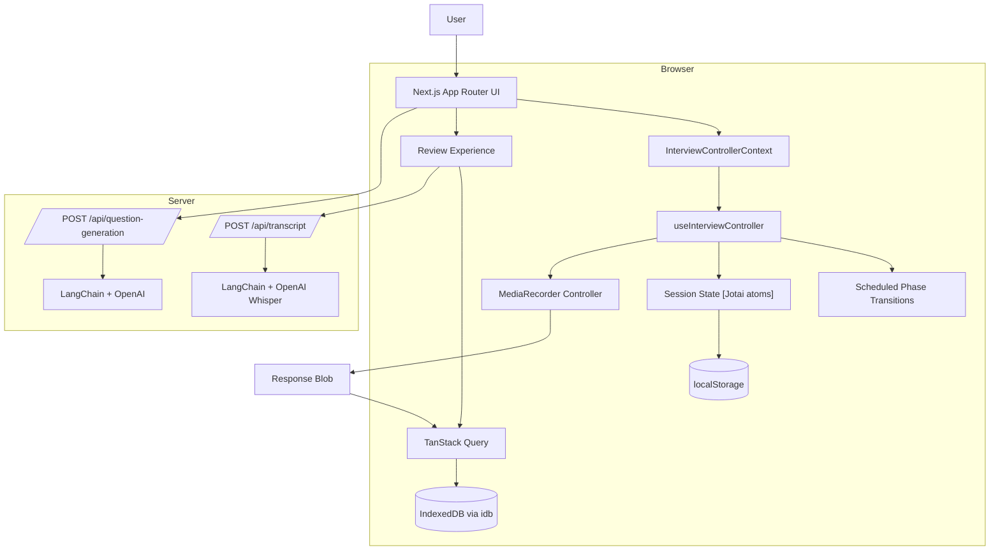

# Pulse

Pulse is a local-first interview practice app built around in-browser video recording, review workflows, and optional AI-assisted feedback. The app keeps the main recording flow client-side, while AI workflows like transcription and question generation run through server APIs.

https://github.com/user-attachments/assets/39d79409-1e49-4383-9f28-3466839ba30c

## Overview

The goal of the project was to make interview practice feel fast and local-first without relying on continuous video uploads or server-managed recording sessions.

Recordings are captured directly in the browser with `MediaRecorder`, stored locally in IndexedDB, and loaded back into the review UI through TanStack Query. AI features are opt-in rather than part of the core recording flow.

The initial prototype was generated using Cursor + GPT-5.5, but the generated implementation quickly hit scaling limits around state coupling, recording orchestration, and async coordination. The project was later restructured around a dedicated interview runtime `useInterviewController()` with clearer separation between timing, media, persistence, and review flows.

## Architecture



## Interview Controller

The interview flow is coordinated through `useInterviewController()` in `/src/logic/interview-controller.ts` and provided to the UI through `InterviewControllerContext`.

`useInterviewController()` centralizes timing, recording lifecycle, persistence coordination, and review handoff behind a single runtime abstraction, reducing coupling between UI, media APIs, and persistence flows.

Internally, the controller manages:

* countdown and recording state;
* phase progression through scheduled transitions;
* camera and microphone setup with `getUserMedia`;
* recording lifecycle events from `MediaRecorder`;
* persistence when recordings are finalized.

## Persistence

Interview sessions contain both lightweight application state and large blob recordings, so the app uses separate storage layers for each. Keeping recordings local allows review sessions to load immediately without waiting for uploads or remote processing.

| Data                                       | Storage                |
| ------------------------------------------ | ---------------------- |
| Interview config, metadata, question lists | Jotai + `localStorage` |
| Recorded video blobs                       | IndexedDB via `idb`    |
| Blob reads/writes/deletes                  | TanStack Query         |

The review UI loads recordings through queries and mutations rather than reaching into IndexedDB directly from components.

## Recording Flow

1. The user configures an interview session.
2. The browser requests camera and microphone access.
3. `useInterviewController()` initializes a `MediaRecorder` instance and local preview stream.
4. Scheduled transitions advance countdown and recording phases.
5. When a response ends, the finalized blob is written to IndexedDB and linked to session metadata.
6. The review UI loads recordings locally for playback.
7. Optional transcription uploads a selected recording to a server-side API powered by OpenAI and LangChain.

## Technical Notes

A few implementation details that shaped the project:

* recorded blobs are persisted separately from session metadata to avoid `localStorage` size and serialization limits;
* browser object URLs are cleaned up during review flows to avoid leaking memory;
* retakes coordinate async recorder teardown before replacing existing recordings;
* TanStack Query is used as the async coordination layer for blob persistence so loading, mutation, and retry flows behave consistently across local and server-backed features;
* transcription and AI question generation are isolated from the main loop so the core interview flow still works without uploading takes to the server.

## Tech Stack

* **Framework:** Next.js App Router, React, TypeScript
* **State:** Jotai
* **Async data:** TanStack Query
* **Storage:** `localStorage`, IndexedDB, `idb`
* **Media APIs:** `MediaRecorder`, `getUserMedia`
* **AI workflows:** LangChain, OpenAI, Whisper
* **UI:** Tailwind CSS, shadcn/ui, Framer Motion
* **Internationalization:** `next-intl`
* **Deployment:** OpenNext on Cloudflare Workers
* **Analytics:** Posthog

## Running Locally

```bash
npm install
npm run dev
```

Open the local Next.js URL in a browser and allow camera/microphone permissions when starting a session.

Optional AI workflows require:

```bash
OPENAI_API_KEY=your_api_key
```

Without an API key, the core interview workflow still works locally. Question generation falls back to built-in prompts, while transcription requires the API key.

## Scripts

```bash
npm run dev       # Start development server
npm run build     # Build the app
npm run lint      # Run Biome checks
npm run format    # Format with Biome
npm run preview   # Preview with OpenNext
npm run deploy    # Deploy with OpenNext
```
